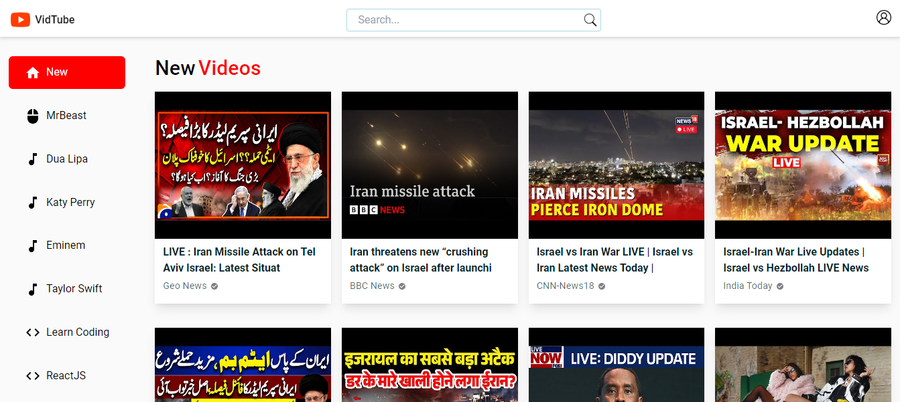

# Vidtube

<h2 className="underline">Overview</h2>

A Video Player project utilizing the YouTube API from RapidAPI, featuring user authentication with basic login and signup functionality, it contains the following features:

  During this project, I implemented a dynamic data-fetching function to handle API requests from various endpoints. This function was designed to handle different functionalities, such as retrieving video data and handling search queries.

To avoid passing props excessively throughout components, I created a context using Boolean values. This approach allowed flexible customization of functionalities across components without the need to pass numerous props.

  On the backend, I used Express and the MVC pattern to structure the application efficiently. I implemented user authentication with basic login and signup functionalities. For managing   user sessions, I used cookie-based sessions, which help to keep users logged in for a specified duration after authentication.

For the frontend, I created a custom hook that connects with the backend, ensuring efficient and reliable data retrieval. Additionally, I implemented dynamic routing to enable navigation to specific channels or videos using their respective IDs. I also developed a search bar component to allow users to search for content based on the input value and ensure the application is fully responsive and accessible across all different devices.

<h2>Technologies and Integrations</h2>

React, Typescript, TailwindCSS, Material UI and Node.js.

<a href="https://rapidapi.com/ytdlfree/api/youtube-v31">API Link</a>

Server is running in BACKEND_PORT=3000

<h2 className="underline">Explore the project</h2>

  For a deeper dive into the project and its features, visit the 
<a href="https://vidtube-pi.vercel.app">project page.</a>

